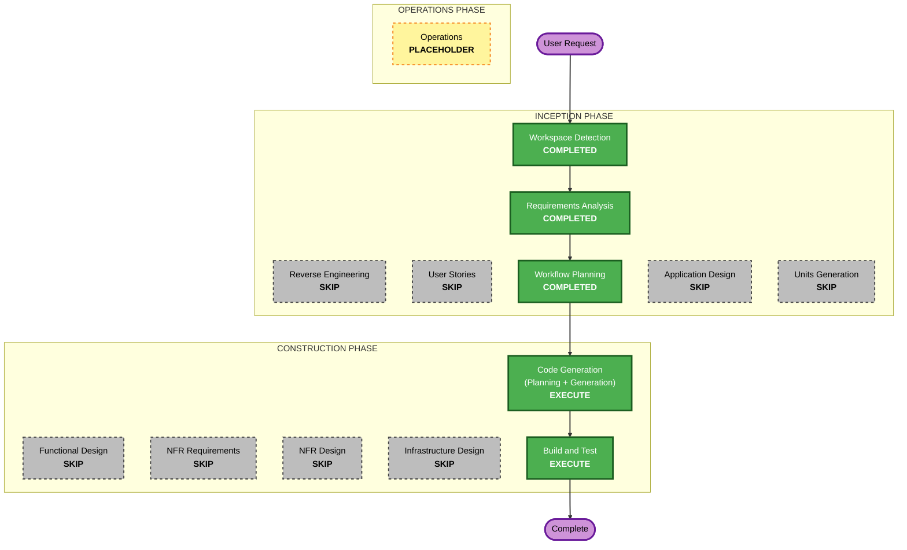

# Execution Plan — postal_validator

## Detailed Analysis Summary

### Change Impact Assessment
- **User-facing changes**: Yes — a CLI (`python -m postal_validator`) and an importable API.
- **Structural changes**: No (new greenfield package; no existing architecture to alter).
- **Data model changes**: Minimal — one small value object `ValidationResult`.
- **API changes**: New public API (`validate`, `normalize`, `ValidationResult`).
- **NFR impact**: Stdlib-only constraint, Python-3.9 compatibility, exit-code semantics.

### Risk Assessment
- **Risk Level**: Low — isolated, pure-function library; behavior pinned by a provided test suite.
- **Rollback Complexity**: Easy (self-contained new files).
- **Testing Complexity**: Simple — example-based tests provided; add stdlib property-based tests.

## Workflow Visualization



### Text Alternative (always included)
```
INCEPTION
  - Workspace Detection ....... COMPLETED
  - Reverse Engineering ....... SKIP (no implemented system)
  - Requirements Analysis ..... COMPLETED
  - User Stories .............. SKIP (clear spec, no personas)
  - Workflow Planning ......... COMPLETED
  - Application Design ........ SKIP (single module)
  - Units Generation .......... SKIP (single unit)
CONSTRUCTION
  - Functional Design ......... SKIP (pure functions, rules already specified)
  - NFR Requirements .......... SKIP (folded into requirements.md)
  - NFR Design ................ SKIP
  - Infrastructure Design ..... SKIP (no infra)
  - Code Generation ........... EXECUTE  (unit: postal-validator-core)
  - Build and Test ............ EXECUTE
OPERATIONS
  - Operations ................ PLACEHOLDER
```

## Phases to Execute

### 🔵 INCEPTION PHASE
- [x] Workspace Detection (COMPLETED)
- [x] Reverse Engineering (SKIPPED) — *Rationale*: greenfield; no implemented system to analyze.
- [x] Requirements Analysis (COMPLETED)
- [x] User Stories (SKIPPED) — *Rationale*: internal utility + CLI; behavior fully pinned by tests; no personas/UX flows.
- [x] Workflow Planning (COMPLETED)
- [ ] Application Design — **SKIP** — *Rationale*: one small module, no service layer or component graph.
- [ ] Units Generation — **SKIP** — *Rationale*: a single unit of work; no decomposition needed.

### 🟢 CONSTRUCTION PHASE
- [ ] Functional Design — **SKIP** — *Rationale*: logic is pure functions whose rules are exhaustively
  specified in `reference/formats.md`; testable properties captured in requirements.md and the code-gen plan.
- [ ] NFR Requirements — **SKIP (folded)** — *Rationale*: NFRs are minimal and already documented in
  `requirements.md` (stdlib-only, 3.9 compatibility, exit codes); PBT-09 framework decision recorded in `aidlc-state.md`.
- [ ] NFR Design — **SKIP** — *Rationale*: no cross-cutting NFR patterns/components to design.
- [ ] Infrastructure Design — **SKIP** — *Rationale*: no infrastructure, deployment, or cloud resources.
- [ ] Code Generation — **EXECUTE (ALWAYS)** — *Rationale*: implement the package + CLI + tests (single unit).
- [ ] Build and Test — **EXECUTE (ALWAYS)** — *Rationale*: run the full test suite and document build/test.

### 🟡 OPERATIONS PHASE
- [ ] Operations — PLACEHOLDER

## Units of Work
1. **postal-validator-core** — the `postal_validator` package (core validation/normalization + CLI)
   and its tests. Single unit; no inter-unit dependencies.

## Estimated Timeline
- **Total executing stages**: 5
- **Estimated Duration**: Short — single implementation pass plus test run.

## Success Criteria
- **Primary Goal**: A stdlib-only `postal_validator` package whose `validate`/`normalize` and CLI
  behave exactly per `reference/formats.md`.
- **Key Deliverables**:
  - `postal_validator/__init__.py` exporting `validate`, `normalize`, `ValidationResult`.
  - Core rule engine for CA/US/UK.
  - `postal_validator/__main__.py` CLI (single, `--json`, stdin batch, exit codes, `--help`).
  - Property-based tests (stdlib) complementing the provided example-based tests.
- **Quality Gates**:
  - All tests in `tests/` pass (`test_core.py`, `test_cli.py`).
  - Added property-based tests pass.
  - No third-party runtime dependencies; runs under Python 3.9.
