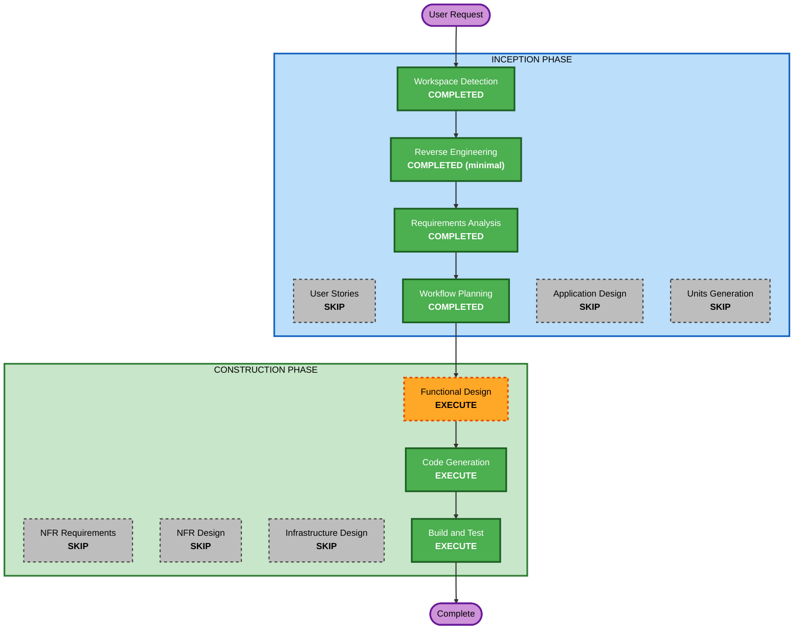

# Execution Plan — Loans Extension

## Detailed Analysis Summary

### Transformation Scope (Brownfield)
- **Transformation Type**: Single component (additive feature within the `app/` package)
- **Primary Changes**: New `Loan` entity, `LoanRepository`, `LoanService`, loan schemas, a loans router, plus a member-loans listing route; wiring in `database.py`, `deps.py`, `main.py`.
- **Related Components**: Reuses `Book`/`Member` repositories (existence checks, copy counts) and shared `Page[T]` / `paginate` / `AppError`.

### Change Impact Assessment
- **User-facing changes**: Yes — three new endpoints.
- **Structural changes**: No — reuses the established layered pattern.
- **Data model changes**: Yes — new in-memory `Loan` entity (no external schema/DB).
- **API changes**: Yes — additive only; existing endpoints unchanged.
- **NFR impact**: None new (same stack, in-memory store).

### Component Relationships
- **Primary Component**: `app/` (new loans slice)
- **Shared Components**: `pagination.Page`/`paginate`, `exceptions.AppError`, `config.MAX_ACTIVE_LOANS`
- **Dependent Components**: none (additive)

### Risk Assessment
- **Risk Level**: Low
- **Rollback Complexity**: Easy (additive; revert new files + small wiring edits)
- **Testing Complexity**: Simple (behavior pinned by `tests/test_loans.py`)

## Workflow Visualization

## Phases to Execute

### INCEPTION PHASE
- [x] Workspace Detection (COMPLETED)
- [x] Reverse Engineering (COMPLETED — minimal depth)
- [x] Requirements Analysis (COMPLETED)
- [x] User Stories — SKIP
  - **Rationale**: Behavior fully pinned by `tests/test_loans.py`; single implicit actor; no UX/persona ambiguity.
- [x] Workflow Planning (COMPLETED)
- [ ] Application Design — SKIP
  - **Rationale**: No new architecture; reuses the established layered pattern. Component shape captured in Functional Design instead.
- [ ] Units Generation — SKIP
  - **Rationale**: Single cohesive unit (`loans`).

### CONSTRUCTION PHASE
- [ ] Functional Design — EXECUTE
  - **Rationale**: Introduces a new `Loan` entity, a status lifecycle, and 5 business rules worth documenting.
- [ ] NFR Requirements — SKIP
  - **Rationale**: Same tech stack; no new performance/scalability targets; in-memory store.
- [ ] NFR Design — SKIP
  - **Rationale**: Follows NFR Requirements skip.
- [ ] Infrastructure Design — SKIP
  - **Rationale**: No infrastructure/deployment changes (in-memory storage).
- [ ] Code Generation — EXECUTE (ALWAYS)
- [ ] Build and Test — EXECUTE (ALWAYS)

## Unit
- **`loans`** — the single unit of work for this feature.

## Success Criteria
- **Primary Goal**: `tests/test_loans.py` passes; book/member tests stay green.
- **Key Deliverables**: Loan model, repository, service, schemas, router, and wiring; updated tests/docs as needed.
- **Quality Gates**: No new dependencies; conventions matched; clean PR-ready diff; Security Baseline compliance summary (no blocking findings).
